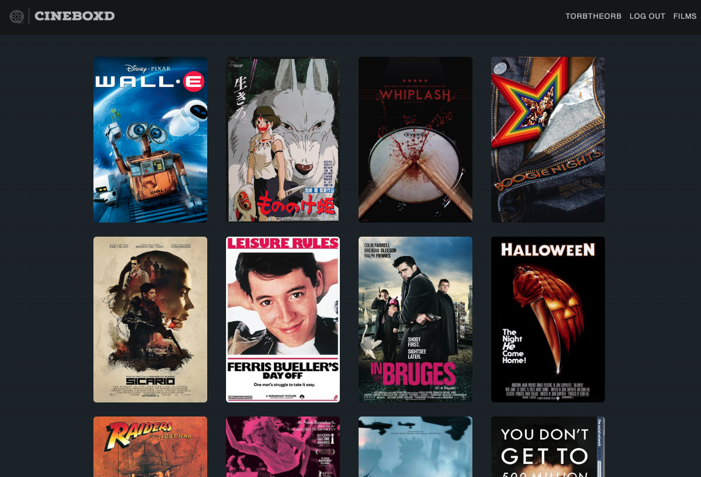
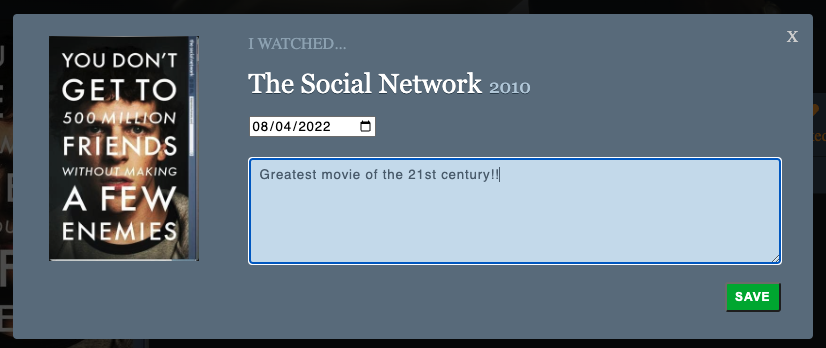

## Cineboxd

Link: [Cineboxd](https://cineboxd.herokuapp.com/#/)


## Overview

Cineboxd is a clone of [Letterboxd](https://letterboxd.com/), a social media site for people who love movies. Primary features include:
* User Authentication
* Film Reviews (CRUD)
* Tracking movie Likes and Logs


### Technologies

* Rails backend and PostgreSQL DB
* React and Redux frontend
* AWS S3 for image storage


### User Authentication

Users are able to provide a username, email and password to create an account. A demo login button is also included so anyone can give the site a test run without using a profile if needed. Current functionality restricts all access beyond the basic home page for those not signed in. 

### Basic Navigation

Upon signing in, users can access the linked poster list on the home page to visit show pages for the featured films.


Alternatively, click the Films button in the top right of the navbar to see the full list of films included on the site.



### Film Show Page & Reviews

Once you've landed on a film's show page, you will see backdrop image, poster, and some background information on the film. You will also have an action box for all of your functionality. The status of your likes and logs is dynamic.

You can write a review and include the date that you watched the film. Coming soon, this review will render along with reviews from other users on the film's show page.




## Technical Challenges

### Modal Flexibility

In order to make the modals on my site more flexible and easier to replicate, I set up some basic modal actions that could apply to all the different types of modals I used. Each modal used the same basic OPEN and CLOSE actions, but dynamically rendered specific modals with unique elements and styling based on the modal_type that was passed in.

```js

function Modal({modal, closeModal}) {
    if (!modal) {
        return null;
    }
    let targetComponent;
    switch (modal.modal_type) {
        case 'login':
            targetComponent = <LoginFormContainer />;
            break;
        case 'signup':
            targetComponent = <SignupFormContainer />
            break;
        case 'review':
            targetComponent = <NewReviewFormContainer />
            break;
        case 'edit-review':
            targetComponent = <UpdateReviewFormContainer />
            break;
        default:
            return null;
    }

    return(
        <div className={`modal-background-${modal.modal_type}`} onClick={closeModal}>
            <div className={`modal-child-${modal.modal_type}`} onClick={e => e.stopPropagation()}>
                {targetComponent}
            </div>
        </div>
    )
};

```

## Future Scope Features

* Show reviews of a film on its show page
* Films index page
* Search functionality
* List building (ex. My Favorite Comedies of the 2010s)
